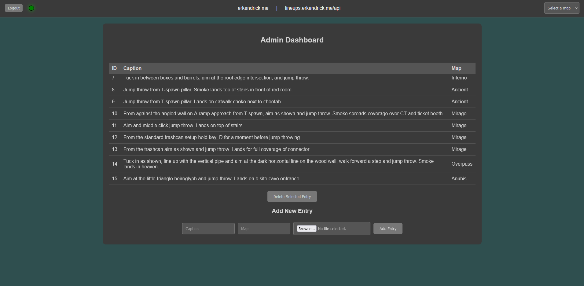

# CS-Lineups

CS-Lineups is a full-stack image gallery and REST API designed for managing CS2 lineups and utility usage examples. It includes a control panel secured with JWT authorization, allowing an authorized user to view, add, delete, and update entries directly from the browser. 

## Control Panel View

## Features
- Secure control panel with JWT authorization
- database management from web browser
- REST API for CRUD operations

## Technologies & Libraries Used 
- React, Node.js, MySQL
- JWT and bcrypt for authorization
- Hosted on AWS EC2 and RDS

## Disclaimer
This project was developed for educational and personal use only, with no commercial intent. Any similarities to existing applications are coincidental.