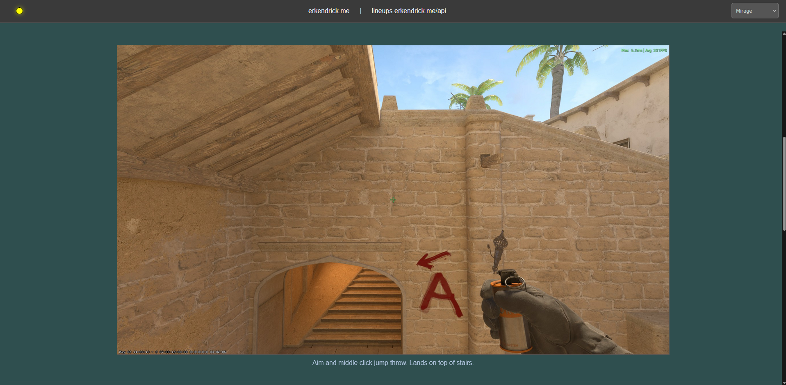

# CS-Lineups

CS-Lineups is a full-stack image gallery and REST API designed for managing CS2 lineups and utility usage examples.
It includes a control panel secured with JWT authorization, allowing an authorized user to view, 
add, delete, and update entries directly from the browser. The image gallery can be viewed in browser 
at [erkendrick.github.io/cs-lineups](https://erkendrick.github.io/cs-lineups). 

## What It Looks Like

## Control Panel View

## Technologies & Libraries Used 
- React, Node.js, MySQL
- JWT and bcrypt for authentication
- Hosted on AWS EC2 and RDS

## What I've Learned

The original frustration that sparked the idea for this application was my lack of knowledge in Counter-Strike 2
utility lineups. I played the game, discovered lineups that I use on my own, and documented those lineups for 
future reference. With content creation out of the way, I realized that hosting and sharing my images aligned 
directly with my goal of becoming a better web developer. 

I began constructing the frontend with React and recognized the opportunity to use my existing knowledge of 
Node.js to write server code to handle HTTP methods and events from the React app. I chose AWS and EC2 to run
my server code due to ubiquity in cloud computing and fair pricing options for an application that 
should never breach free tier use terms. 

While working with AWS, I also discovered RDS, which provided a structured environment to practice 
and enhance my SQL knowledge. In earlier versions, I stored images in an assets folder within the React 
build on GitHub Pages. Wanting to try something new and arbitrary, I experimented with storing images directly in a 
MySQL database as binary blobs. Although this does slow down load times, especially for .gifs and larger images, 
it worked well enough for my purposes and remains a functional solution.

## Disclaimer
This project was developed for educational and personal use only, with no commercial intent. 
Any similarities to existing applications are coincidental. All images are captured, edited, 
and uploaded by myself. Feel free to use them as you like, but some recognition would be appreciated if 
you publicly distribute these images.